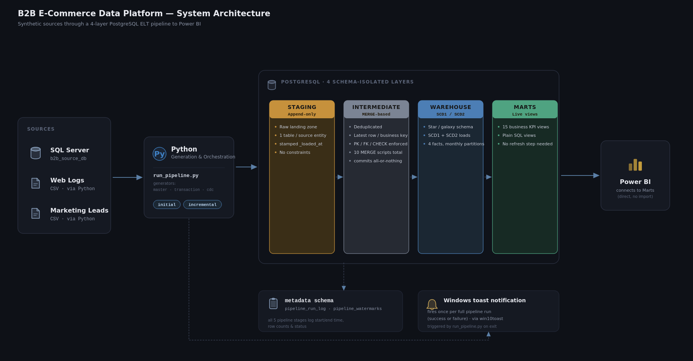
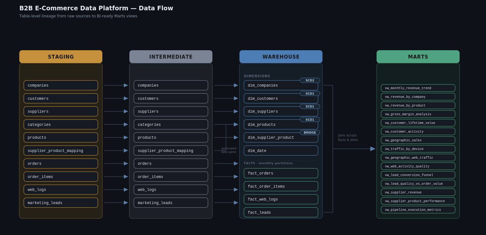
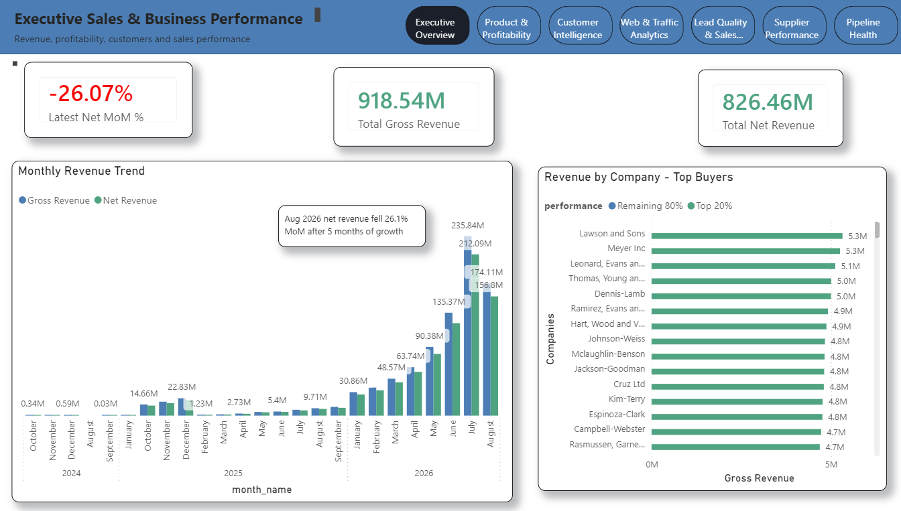
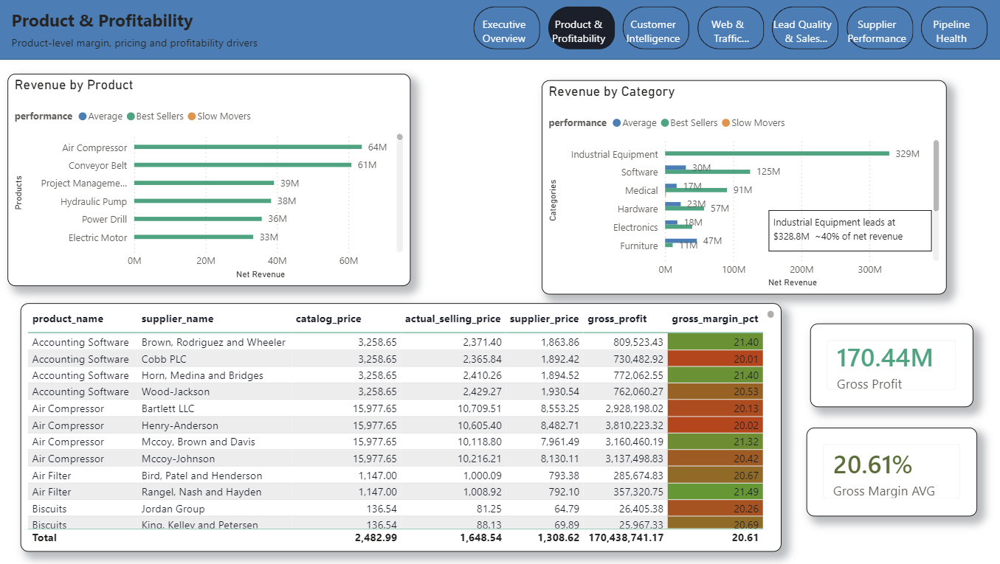
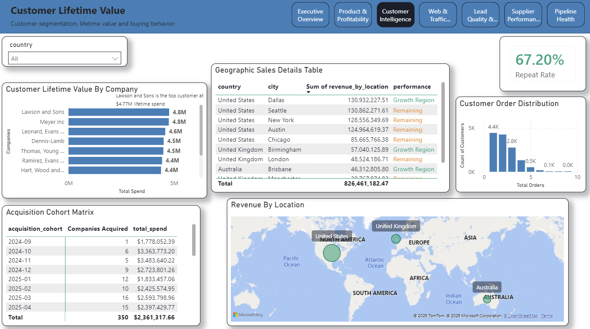
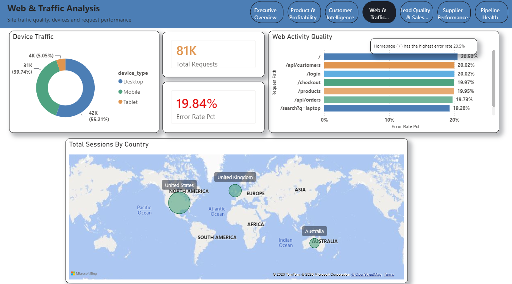
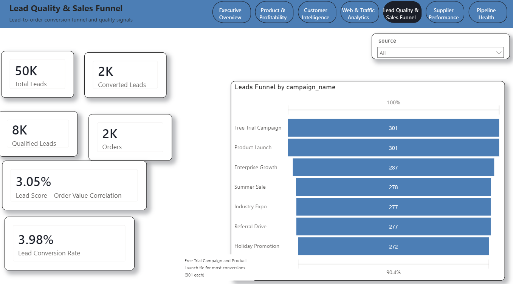
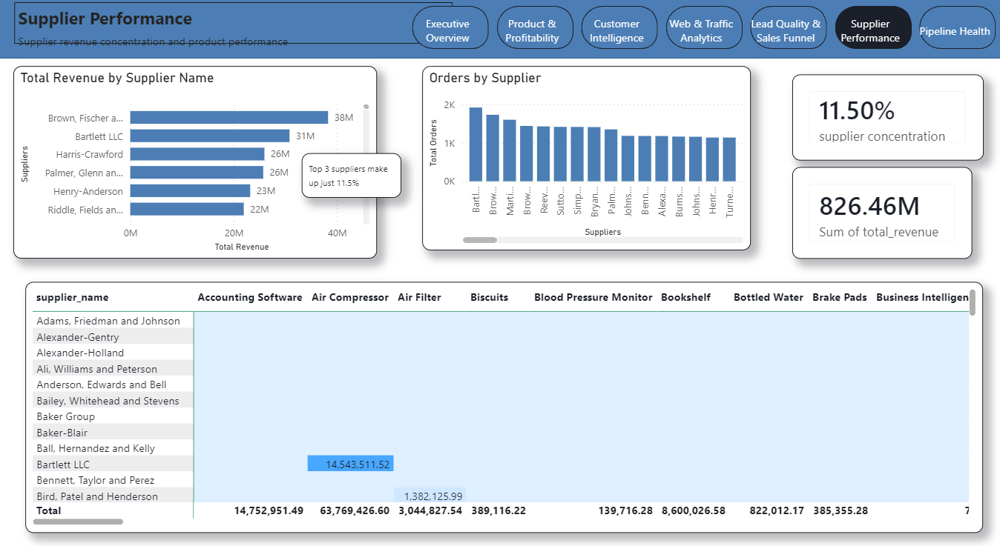
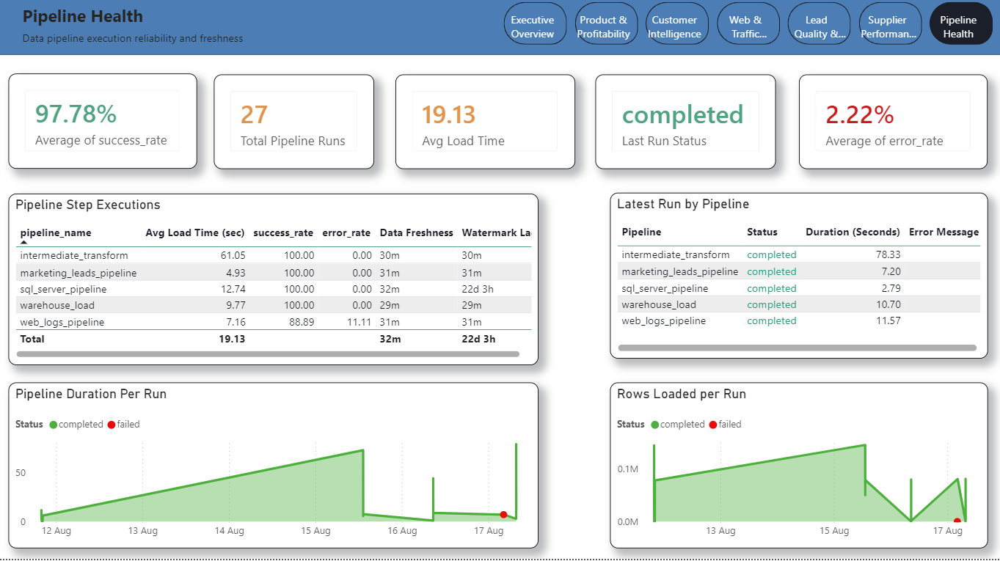

# B2B Data Platform — End-to-End ELT Pipeline

A Data Engineering internship project implementing an end-to-end **ELT data platform for a synthetic B2B e-commerce business**.

Three operational data sources are continuously generated, ingested into PostgreSQL, transformed through an Intermediate layer, modeled into a dimensional Warehouse (SCD Type 1 & 2, monthly-partitioned facts), and served through 15 business KPI views ready for Power BI.

**For the full technical deep-dive** — business rules, data model, layer-by-layer internals, execution flow, performance decisions, and requirements traceability — see the [Project Document](docs/project_document.md).

---

## Project Goal

```text
Data Generation → Source Systems → PostgreSQL Staging → PostgreSQL Intermediate
     → PostgreSQL Warehouse → PostgreSQL Marts → Business KPIs
```

**15 analytical KPI views** covering Revenue, Customers, Orders, Products, Suppliers, Marketing Leads, Lead Conversion, Web Traffic, and Operational Pipeline Performance.

---

# Architecture






---

# Dashboard















The Power BI dashboard lives in `docs/dashboard/` in two forms:

* **`dashboard.pbix`** — the compiled report with data already loaded. Open it directly in Power BI Desktop to view the dashboard immediately, no database setup required.
* **`dashboard.pbip`** / **`dashboard.Report`** / **`dashboard.SemanticModel`** — the same report as plain-text source (Power BI Project format), so the report definition, DAX measures, and model are readable and diffable in git. Opening this version and refreshing requires a live PostgreSQL connection to a `b2b_warehouse_db` populated via the Deployment Guide below — Desktop will prompt for those connection details on open.

---

# Data Sources

Three independent source systems, all generated by Python.

| Source | Format | Entities |
|---|---|---|
| SQL Server (`b2b_source_db`) | Operational database | Companies, Customers, Suppliers, Categories, Products, Supplier Product Mapping, Orders, Order Items |
| Web Logs | CSV | Request logs — device, browser, status code, bot indicator; no downstream sessionization needed, generated directly at source |
| Marketing Leads | CSV | Lead source, campaign/UTM, company profile, score, funnel stage — no customer/company FK, since a lead can exist before a matching record does |

Full entity-relationship detail: [Project Document → Business Data Model](docs/project_document.md#business-data-model).

---

# Technology Stack

**Programming:** Python, Pandas
**Databases:** Microsoft SQL Server, PostgreSQL
**Data Engineering:** ELT, CDC simulation, per-table watermark-based incremental extraction, idempotent SQL `MERGE` transformations, dimensional modeling (star/galaxy schema, SCD Type 1 & 2), monthly fact partitioning, pipeline metadata & full-stage execution logging
**Notifications:** Local Windows toast (`win10toast`) on pipeline success/failure
**Visualization:** Power BI

---

# Project Status

| Milestone | Status |
|---|---|
| 1 — Project Setup & Source Data Generation | Completed |
| 2 — CDC & Continuous Source Simulation | Completed |
| 3 — ELT Ingestion & Staging | Completed |
| 4 — Intermediate Layer | Completed |
| 5 — Warehouse | Completed |
| 6 — Marts & Analytics (15/15 KPI views) | Completed |

Full milestone detail and Git history: [Project Document → Git Milestone History](docs/project_document.md#git-milestone-history).

---

# Project Structure

```text
B2B-Data-Platform/
│
├── .env                              (gitignored — copy from .env.example)
├── .env.example
├── README.md
├── requirements.txt
│
├── config/                           config.py, database.py
├── data/                              marketing_leads/, web_logs/  (generated CSVs)
├── docs/                              project_plan.md, project_document.md
├── logs/                              pipeline.log
│
├── postgresql/
│   ├── staging/                       staging_ddl.sql
│   ├── intermediate/                  DDL/, transform/ (10 scripts), tests/ (10 scripts)
│   ├── warehouse/                     DDL/, Load/ (9 scripts), PARTITIONS_SETUP/, tests/
│   ├── marts/                         KPI1.sql ... KPI15.sql, marts_ddl.sql
│   └── metadata/                      metadata_ddl.sql
│
├── python/
│   ├── generators/                    master_generator.py, transaction_generator.py, cdc_generator.py
│   ├── pipelines/                     run_pipeline.py + 3 staging pipelines
│   └── utils/                         constants.py, date_weighting.py, notifier.py, pipeline_utils.py, ...
│
└── sql_server/                        source1/, metadata/, exploration/
```

---

# Deployment Guide

## 1. Prerequisites

* Python 3.10+
* Microsoft SQL Server (Express is fine) with **ODBC Driver 17 for SQL Server** installed
* PostgreSQL 15+ (the warehouse/marts layers use `MERGE`, added in Postgres 15)

## 2. Clone and install dependencies

```bash
git clone <this-repo-url>
cd B2B-Data-Engineering-Platform
pip install -r requirements.txt
```

## 3. Configure environment

```bash
cp .env.example .env
# then edit .env with your local SQL Server / PostgreSQL connection details
```

`config/database.py` validates all required variables at import time and raises immediately if any are missing.

## 4. Create the databases

Create an empty PostgreSQL database matching `POSTGRESQL_DATABASE` in your `.env`. (SQL Server's database is created automatically by the DDL in the next step — don't pre-create it.)

## 5. Run the DDL, in this exact order

SQL Server first — `ddl-source1.sql` drops and recreates `b2b_source_db` from scratch, so it must run **before** `ddl-metadata.sql`, otherwise the metadata schema gets wiped out:

```text
sql_server/source1/ddl-source1.sql        -- source schema (8 operational tables)
sql_server/metadata/ddl-metadata.sql      -- metadata.Generation_Seeds
```

Then PostgreSQL, layer by layer (each script is idempotent — safe to re-run):

```text
postgresql/metadata/metadata_ddl.sql          -- pipeline_watermarks, pipeline_run_log
postgresql/staging/staging_ddl.sql            -- raw landing tables
postgresql/intermediate/DDL/intermediate_ddl.sql
postgresql/warehouse/DDL/warehouse_ddl.sql
postgresql/warehouse/PARTITIONS_SETUP/partitioning.sql
postgresql/marts/marts_ddl.sql                -- 15 KPI views
```

Run each with your preferred PostgreSQL client (psql, pgAdmin, DBeaver) or via `psql -f <file> -d <database>`.

## 6. First run — bootstrap with 2 years of historical data

```bash
python -m python.pipelines.run_pipeline initial
```

Generates the full master + historical transaction dataset, loads it through SQL Server, and runs the complete pipeline through to the Warehouse. Takes several minutes — tens of thousands of rows across 3 sources.

## 7. Ongoing runs — daily incremental

```bash
python -m python.pipelines.run_pipeline incremental
```

Simulates one day of new activity (new orders/leads/web logs, CDC updates to existing records, product deactivations) through the full pipeline. Run repeatedly to simulate additional days.

## 8. Validate

Run the SQL files under `postgresql/intermediate/tests/` and `postgresql/warehouse/tests/` — every query is written to return 0 rows on success. No pytest suite by design (see [Project Document → Requirements Traceability](docs/project_document.md#requirements-traceability)) — validation is manual, end-to-end.

## 9. Connect Power BI

Point Power BI's PostgreSQL connector at your `POSTGRESQL_DATABASE`, schema `marts` — all 15 `vw_*` views are listed directly in the navigator.

---

<a id="query-examples"></a>
# Query Examples

All 15 KPI views live in the `marts` schema. Each also has its own readable, standalone source file under `postgresql/marts/KPI<N>.sql`.

| # | View | Business Question |
|---|------|--------------------|
| 1 | `marts.vw_monthly_revenue_trend` | Gross/net revenue by month with MoM growth % |
| 2 | `marts.vw_revenue_by_company` | Top buyer companies by revenue; top-20% Pareto split |
| 3 | `marts.vw_revenue_by_product` | Bestsellers vs. slow-movers by product/category |
| 4 | `marts.vw_gross_margin_analysis` | Margin % per product/supplier vs. catalog price |
| 5 | `marts.vw_customer_lifetime_value` | Total spend per buyer company, by acquisition cohort |
| 6 | `marts.vw_customer_activity` | Orders per customer, AOV, repeat purchase rate |
| 7 | `marts.vw_geographic_sales` | Revenue/orders by country and city |
| 8 | `marts.vw_traffic_by_device` | Desktop/Mobile/Tablet traffic and checkout-reach rate |
| 9 | `marts.vw_geographic_web_traffic` | Sessions and top traffic sources by location |
| 10 | `marts.vw_web_activity_quality` | 4xx/5xx error rate by endpoint |
| 11 | `marts.vw_lead_conversion_funnel` | Lead → order conversion by source/campaign/channel |
| 12 | `marts.vw_lead_quality_vs_order_value` | Correlation between lead score and order value |
| 13 | `marts.vw_supplier_revenue` | Revenue and concentration by supplier |
| 14 | `marts.vw_supplier_product_performance` | Best-performing supplier-product combinations |
| 15 | `marts.vw_pipeline_execution_metrics` | Load times, success/error rate, watermark lag by pipeline stage |

Example — top 10 buyer companies, with Pareto tier:

```sql
SELECT company_name, gross_revenue, company_rank, cumulative_revenue_pct, performance
FROM marts.vw_revenue_by_company
ORDER BY company_rank
LIMIT 10;
```

Example — this month's revenue trend:

```sql
SELECT year, month_name, net_revenue, net_mom_pct
FROM marts.vw_monthly_revenue_trend
ORDER BY year DESC, month_name
LIMIT 6;
```

Example — worst-performing web endpoints:

```sql
SELECT request_path, total_requests, error_rate_pct
FROM marts.vw_web_activity_quality
ORDER BY error_rate_pct DESC
LIMIT 5;
```

---

# Project Objective

```text
Generate → Ingest → Track Changes → Stage → Transform → Model → Validate → Aggregate → Analyze
```

The pipeline is built to be reliable and easy to follow, without more moving parts than the scope
requires. See [Project Document → Requirements Traceability](docs/project_document.md#requirements-traceability)
for how each original requirement was implemented.