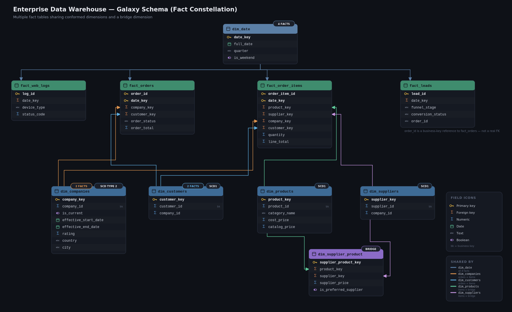

# B2B Data Platform — Project Document

Technical reference for the project: data model, business rules, pipeline internals, execution flow,
performance decisions, and requirements traceability.

For a fast overview, setup instructions, and KPI query examples, see [README.md](../README.md).

---

# Project Overview

This project implements an ELT pipeline for a synthetic B2B e-commerce business. Three source systems
(SQL Server, plus two CSV files) are generated by Python, ingested into PostgreSQL, cleaned and validated
in an Intermediate layer, modeled into a dimensional Warehouse, and exposed through 15 KPI views for
Power BI.

```text
Data Generation → Source Systems → Staging → Intermediate → Warehouse → Marts → KPIs
```

---

# Business Data Model

## Companies

A company is either a Buyer or a Supplier. Company history (rating, location) is tracked with SCD Type 2
in the Warehouse — see [Warehouse Layer](#warehouse-layer).

## Customers and Suppliers

Customers belong only to Buyer companies. Suppliers belong only to Supplier companies.

```text
Company (Buyer)             Company (Supplier)
   │                             │
   └── Customer                  └── Supplier
```

The number of customers per company is generated within a configured range.

## Products and Categories

Each product belongs to one category.

```text
Category
   │
   └── Product
```

## Supplier Product Mapping

A product can have multiple suppliers. Each supplier-product pairing stores its own price, lead time, and
preferred-supplier flag — this is the many-to-many link between suppliers and products.

```text
Supplier ─────┐
              ├── Supplier_Product_Mapping ─── Product
Product ──────┘
```

## Orders and Order Items

Each order belongs to one customer (with `company_id` also denormalized onto the order for convenience)
and may optionally originate from a marketing lead. Each order contains one or more order items, and each
order item references a supplier-product mapping. Orders cannot predate the customer who placed them.

```text
Customer
    │
    └── Order ── (optional) Marketing Lead
          │
          └── Order Item ── Supplier Product Mapping
```

Order total is the sum of its order items' line totals: `order_total = SUM(line_total)`. Cancelled orders
are kept for auditability but excluded from revenue KPIs.

## Marketing Leads

Leads are generated independently of customers and companies — a lead can exist before a matching company
record does, so there's no FK between them. A Won lead generates exactly one order:

```text
Total Orders = Repeat Customer Orders + Won Lead Orders
```

Conversion status is calculated in the Intermediate layer, not stored at Staging: a lead with no matching
order is treated as not converted.

## Web Logs

Web logs are an independent analytical stream with no FK into the transactional entities. They connect to
the rest of the model later, at the analytical layer, through dimensions and reporting logic.

## Other Rules

* `updated_at >= created_at` for every record.
* SQL Server extraction uses a per-table watermark on `updated_at` — see
  [CDC & Incremental Loading](#cdc--incremental-loading).

---

# Data Generation

Python generates all three sources.

## Master Generator

Creates the initial master datasets — Companies, Categories, Customers, Suppliers, Products, Supplier
Product Mapping — establishing the base business relationships. Onboarding timestamps are seasonally/
weekly weighted (`python/utils/date_weighting.py`, `ONBOARDING_MONTH_WEIGHTS`/`ONBOARDING_DOW_WEIGHTS` in
`constants.py`), so activity skews toward January/Q1 and weekdays instead of being uniformly random.

## Transaction Generator

Produces Marketing Leads, Orders, Order Items, and Web Logs, referencing the master data already
persisted in SQL Server. Order and web log timestamps are weighted the same way (`MONTH_WEIGHTS`,
`DOW_WEIGHTS_ORDERS`, `DOW_WEIGHTS_TRAFFIC`, `HOUR_WEIGHTS_TRAFFIC`), producing a Q4 order peak, a summer
dip, weekday skew, and morning traffic spikes.

## CDC Generator

Simulates operational activity after the initial load: new orders/leads/web logs, updates to existing
companies/customers/orders/leads, and soft-deletes on products (the only entity with an `is_active` column
carried through every layer). Each run is seeded with a live, time-based seed rather than the fixed
`RANDOM_SEED` used for the historical backfill — logged to `metadata.Generation_Seeds` — so daily activity
varies from run to run instead of replaying identically.

## Data Generation & CDC Flow

```text
Master Generator → Initial SQL Server Data → Transaction Generator
      (Leads, Orders, Order Items, Web Logs)
              → CDC Generator (inserts, updates, soft-deletes, live-seeded)
                      → ELT Pipelines
```

---

# PostgreSQL Architecture

## Staging Layer

Staging receives data from the three sources with minimal transformation — no PK/FK/UNIQUE constraints,
every row stamped with `_loaded_at`. Deduplication happens downstream, in Intermediate.

Loaded by three pipelines (`python/pipelines/`): `sql_server_pipeline.py` (per-table watermark
extraction) and `marketing_leads_pipeline.py` / `web_logs_pipeline.py` (full-reload snapshots — the CSV
sources have no incremental extraction concept).

## Intermediate Layer

Deduplicates (latest row per business key, via `ROW_NUMBER() OVER (PARTITION BY ... ORDER BY _loaded_at
DESC)`), cleans (`TRIM`/`NULLIF` normalization), validates (FK existence, enum membership, price/date
sanity), and `MERGE`s into constrained tables with real PK/FK/CHECK enforcement.

Location: `postgresql/intermediate/transform/` — one `Transform_<entity>.sql` per entity, 10 files
(dependency order in [Execution Flow & Load Order](#execution-flow--load-order)).

<a id="warehouse-layer"></a>
## Warehouse Layer

A dimensional (galaxy) schema: 4 conformed dimensions, a supplier-product bridge dimension, and 4 fact
tables.

* `dim_date` — static calendar dimension, generated once for the full project date range
* `dim_companies` — SCD Type 2. History tracked via `effective_start_date`/`effective_end_date`/
  `is_current`, enforced by a partial unique index (`WHERE is_current = TRUE`)
* `dim_customers`, `dim_suppliers`, `dim_products` — SCD Type 1 (overwrite in place)
* `dim_supplier_product` — bridges suppliers and products, carrying the price negotiated for that specific
  pairing (not an attribute of either dimension alone, since the same product has different prices from
  different suppliers)
* `fact_orders` — one row per order; `order_status`/`payment_status` are kept current via `MERGE`
* `fact_order_items` — one row per order item; `quantity`/`unit_price`/`line_total` are insert-only, but
  the denormalized `order_status`/`payment_status` are updated via `MERGE` as CDC mutates the parent order
* `fact_web_logs` — insert-only; web requests are immutable once logged
* `fact_leads` — `funnel_stage`, `lead_score`, `conversion_status`, and `order_id` are kept current via
  `MERGE`, since CDC mutates a lead's stage/score and conversion flips once a matching order appears

All fact tables are partitioned monthly by `date_key`
(`postgresql/warehouse/PARTITIONS_SETUP/partitioning.sql`). Every fact load resolves `company_key` with an
as-of join against `dim_companies`' SCD2 window — matching `company_id` and the transaction's own
timestamp falling between `effective_start_date` and `effective_end_date` — so each fact row carries the
company version that was current at the time of that transaction.

Location: `postgresql/warehouse/` — `DDL/warehouse_ddl.sql`, `Load/load_*.sql` (one per dimension/fact),
`PARTITIONS_SETUP/partitioning.sql`, `tests/`.



## Marts Layer

15 KPI views as plain PostgreSQL views under the `marts` schema (see
[Plain Views, Not Materialized](#plain-views-not-materialized-marts)). They read only from `warehouse` and
`metadata` (KPI 15) — never `intermediate` or `staging`.

Location: `postgresql/marts/` — `KPI1.sql` … `KPI15.sql` (readable, standalone source per KPI) plus
`marts_ddl.sql`, which wraps each into `CREATE OR REPLACE VIEW marts.vw_<name>`.

---

<a id="execution-flow--load-order"></a>
# Execution Flow & Load Order

Individual scripts document their own execution flow inline — see the header comment in each
`Transform_*.sql` / `load_*.sql` file for entity-specific detail. This section is the consolidated
picture: what runs, in what order, and why.

## Staging → Intermediate (10 scripts, one transaction)

Order enforced by `run_transform()` in `python/pipelines/run_pipeline.py`:

```text
1.  Transform_companies.sql
2.  Transform_categories.sql
3.  Transform_customers.sql                  (depends on companies)
4.  Transform_suppliers.sql                  (depends on companies)
5.  Transform_products.sql                   (depends on categories)
6.  Transform_supplier_product_mapping.sql   (depends on suppliers, products)
7.  Transform_marketing_leads.sql
8.  Transform_orders.sql                     (depends on customers, companies, leads)
9.  Transform_order_items.sql                (depends on orders, supplier_product_mapping)
10. Transform_web_logs.sql                   (independent)
```

All 10 run in one transaction — a failure anywhere rolls back the whole batch, so Intermediate never ends
up half-updated relative to Staging.

## Intermediate → Warehouse (partitioning + 9 loads)

Order enforced by `run_warehouse_load()`:

```text
1. partitioning.sql               (creates any missing monthly partitions first)
2. load_dim_companies.sql         (SCD2)
3. load_dim_customers.sql         (SCD1)
4. load_dim_suppliers.sql         (SCD1)
5. load_dim_products.sql          (SCD1)
6. load_dim_supplier_product.sql  (depends on dim_suppliers, dim_products)
7. load_fact_orders.sql           (as-of join to dim_companies)
8. load_fact_order_items.sql      (same as-of join, independent of fact_orders)
9. load_fact_web_logs.sql
10. load_fact_leads.sql
```

Each Warehouse load runs in its own transaction. If one load fails, previously completed loads are not
rolled back. This is safe because every load is a `MERGE` — rerunning a load that already succeeded is a
no-op, so a partial-then-retried run still converges to the correct state.

## Warehouse → Marts: no load step

The 15 KPI views are plain views — nothing to execute after `marts_ddl.sql` runs once at setup. They
recompute from the Warehouse on every query, so there's no separate "Marts load" stage.

---

<a id="cdc--incremental-loading"></a>
# CDC & Incremental Loading

The SQL Server pipeline extracts changed rows using a watermark on `updated_at`, tracked **per table**
rather than one combined watermark for the whole pipeline. A single shared watermark would risk a table
that changes less often having its late-arriving rows silently skipped once the shared cutoff moves past
them; per-table watermarks (`sql_server_companies`, `sql_server_orders`, etc., in
`metadata.pipeline_watermarks`) avoid that.

```text
Last watermark (per table) → SQL Server (updated_at > watermark) → Changed rows
        → PostgreSQL Staging → successful load → watermark updated
```

This lets the pipeline pick up new and changed records without re-extracting all 8 SQL Server tables on
every run. The Marketing Leads and Web Logs CSV sources don't use a watermark — they're re-read in full
each run, since there's no incremental extraction concept for a flat file being appended to directly by
the generator.

---

# Data Quality & Monitoring

## Validation

`postgresql/intermediate/tests/` covers Companies, Customers, Categories, Suppliers, Products, Supplier
Product Mapping, Marketing Leads, Orders, Order Items, and Web Logs — validated before Warehouse
development began. `postgresql/warehouse/tests/` covers every dimension and fact, including SCD Type 2
version-integrity checks for `dim_companies` (exactly one current row per company, historical rows
correctly closed) and idempotency re-run checks for every fact load.

## Pipeline Metadata

`metadata.pipeline_run_log` and `metadata.pipeline_watermarks` cover all five pipeline stages — the three
staging pipelines, the Intermediate transform, and the Warehouse load each log their own start/end time,
row count, and status. This supports execution tracking, row-count monitoring, status
(`running`/`completed`/`failed`), error messages, watermark management, and the
`marts.vw_pipeline_execution_metrics` KPI.

Logs are also written to `logs/pipeline.log`. A local Windows toast notification fires once per run,
success or failure, via `python/utils/notifier.py` — it fails silently if the notification can't be
shown, so it never breaks the actual pipeline run.

---

<a id="performance-optimization"></a>
# Performance Optimization

## Monthly Partitioning (Fact Tables)

All 4 fact tables are partitioned monthly by `date_key`
(`postgresql/warehouse/PARTITIONS_SETUP/partitioning.sql`). Most KPI views filter or group by date, so
partition pruning lets those queries skip entire months rather than scanning the whole fact table. The
partition script uses `CREATE TABLE IF NOT EXISTS`, so it's safe to re-run as the date range extends.

<a id="indexing-not-clustering-dimension-tables"></a>
## Indexing, Not Clustering (Dimension Tables)

Every dimension has a B-tree index on its join key(s). The dimensions are not physically clustered with
PostgreSQL's `CLUSTER` command, even though the original design note called for "dimensions clustered by
common join keys."

`CLUSTER` takes an `ACCESS EXCLUSIVE` lock, blocking all reads and writes for its duration, and Postgres
doesn't maintain physical row order after subsequent writes — the benefit decays with every insert/update
and has to be restored by re-running `CLUSTER`. Since every dimension is `MERGE`-upserted on each
incremental run, that would mean either locking the table regularly or accepting a benefit that keeps
decaying. At this project's scale — dimensions top out around 15–16K rows for customers, low hundreds for
most others — B-tree indexes already give the planner fast, lock-free lookups on the same keys, without
`CLUSTER`'s locking or maintenance cost.

<a id="plain-views-not-materialized-marts"></a>
## Plain Views, Not Materialized (Marts)

The 15 KPI views are plain views, not materialized. At this data volume, computing them live from the
Warehouse on every query is fast enough that pre-computing and storing the result — with its own refresh
step, its own `pipeline_run_log` entry, and its own staleness window — isn't worth the added complexity.
Materializing would make sense if query latency became a real problem at meaningfully larger volume; plain
views keep the Marts layer always current with no extra moving parts.

---

# Requirements Traceability

Maps the original requirements document's "Data Generation Requirements," "Deliverables," and
"Constraints & Considerations" sections to what was implemented.

## Data Generation Requirements

| Requirement | Status | Where |
|---|---|---|
| 2 years of historical data (backfill) | Done | `config.py` `START_DATE`/`END_DATE`, `master_generator.py` |
| Continuous daily ingestion | Done | `cdc_generator.py`, `run_pipeline.py incremental` |
| Seasonal patterns (Q4 peak, summer dip) | Done | `python/utils/date_weighting.py`, `MONTH_WEIGHTS` |
| Weekly/daily patterns (weekday orders, morning traffic spikes) | Done | `DOW_WEIGHTS_ORDERS`, `HOUR_WEIGHTS_TRAFFIC` in `constants.py` |
| Geographic distribution (concentrated in HQ locations) | Done | `OPERATING_LOCATIONS` weighted country/city selection |
| Order cancellations (5–10%) | Done | `ORDER_STATUS_WEIGHTS` |
| Bot traffic | Done | `BOT_USER_AGENTS`, 5% weighting in `generate_web_logs()` |
| Multiple device types and browsers | Done | `DEVICE_TYPES`, `BROWSERS` weighted lists |
| Deterministic seeding | Done, with one exception | `RANDOM_SEED = 40`, `Faker.seed()`, per-country seeded instances for the historical backfill. CDC's daily generation uses a live time-based seed instead (logged to `metadata.Generation_Seeds`) so each day's simulated activity varies — see [CDC Generator](#cdc-generator) |

## Deliverables

| Deliverable | Status | Where |
|---|---|---|
| SQLServer DDL | Done | `sql_server/source1/ddl-source1.sql`, `sql_server/metadata/ddl-metadata.sql` |
| PostgreSQL Staging DDL | Done | `postgresql/staging/staging_ddl.sql` |
| PostgreSQL Warehouse DDL | Done | `postgresql/warehouse/DDL/warehouse_ddl.sql` |
| Data Generation Scripts | Done | `python/generators/` |
| 10–15 KPI SQL Views | Done — 15/15 | `postgresql/marts/` |
| ETL Python Scripts — ingestion/staging/warehouse/notifications | Done | `python/pipelines/`, `python/utils/notifier.py` |
| ETL Python Scripts — IP geolocation | Scoped out | `country`/`city` are set directly at generation time rather than derived from `client_ip` — a geolocation lookup against Faker-generated IPs wouldn't resolve to anything meaningful |
| Local Workflow Orchestration | Done | `python/pipelines/run_pipeline.py` |
| Documentation — README, deployment guide, query examples | Done | `README.md`, this document |

## Constraints & Considerations

| Constraint | Status | Notes |
|---|---|---|
| Idempotent design (MERGE) | Done | Every warehouse load is a `MERGE` — safe to retry without duplicates |
| CDC efficiency (watermarks) | Done | Per-table watermarks — see [CDC & Incremental Loading](#cdc--incremental-loading) |
| Partition strategy | Done | All 4 fact tables partitioned monthly by `date_key` |
| Clustering | Satisfied via indexes, not literal `CLUSTER` | See [Indexing, Not Clustering](#indexing-not-clustering-dimension-tables) |
| SCD Type 2 (`dim_companies`) | Done | Verified end-to-end with a live update-and-rerun test |
| No automated tests (pytest) | Honored | Manual SQL test suites (`postgresql/*/tests/`) instead |
| No CI/CD | Honored | Manual/orchestrated execution only, no pipeline automation platform |

---

# Git Milestone History

### July 30, 2026 — Initialize project structure

Initial repository structure and project foundation.

### July/August 2026 — Configuration & constants

Centralized project configuration, business-generation constants, SQL Server and PostgreSQL connections
established.

### August 5, 2026 — Transaction generator + SQL Server master data load

Synthetic transaction generation and SQL Server source population implemented.

### August 6, 2026 — CDC generator + 2-year backfill + continuous ingestion

Historical backfill, CDC simulation, and continuous/incremental source generation completed.

### August 7, 2026 — ELT pipelines, staging schema populated

Source ingestion pipelines and PostgreSQL Staging layer completed.

### August 15, 2026 — Milestone 4 (Intermediate) and Milestone 5 (Warehouse)

Staging-to-Intermediate transformations and validation completed. Warehouse schema validated and
populated: SCD Type 2 `dim_companies`, all dimension/fact loads, monthly partitioning,
`dim_supplier_product` bridge dimension, and full end-to-end pipeline logging. Verified with a complete
`run_pipeline.py` run — generation through Warehouse — with zero errors.

### Current — Milestone 6 (Marts & Analytics)

All 15 KPI views implemented and registered as PostgreSQL views under `marts`. Local Windows toast
notifications wired into pipeline completion/failure.